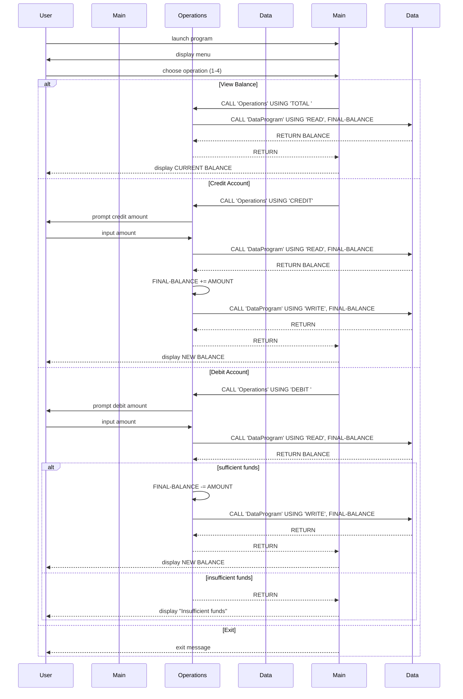

# Week4Lab01 COBOL Project Documentation

## Overview
This project is a small COBOL account management system that simulates basic student account operations: checking balance, crediting, and debiting.

### Files
- `src/cobol/main.cob`
- `src/cobol/operations.cob`
- `src/cobol/data.cob`

## File purposes

### `src/cobol/main.cob`
- Entry point program: `MainProgram`.
- Handles menu display and user interaction.
- Accepts user choice for operations:
  - 1: View Balance
  - 2: Credit Account
  - 3: Debit Account
  - 4: Exit
- Calls `Operations` program with operation code string.

### `src/cobol/operations.cob`
- Delegator program: `Operations`.
- Uses linkage parameter `PASSED-OPERATION` to determine behavior.
- Maintains `FINAL-BALANCE` in working storage (starts at `1000.00`).
- For each operation:
  - `TOTAL `: calls `DataProgram` with `READ` and displays current balance.
  - `CREDIT`: prompts amount, reads current balance, adds amount, writes updated balance, displays new balance.
  - `DEBIT `: prompts amount, reads current balance, checks funds, subtracts and writes updated balance when funds are sufficient; otherwise displays "Insufficient funds".

### `src/cobol/data.cob`
- Storage program: `DataProgram`.
- Simulates persistent student account balance storage via `STORAGE-BALANCE` variable (initially `1000.00`).
- Accepts linkage params:
  - `PASSED-OPERATION` (`READ` or `WRITE`)
  - `BALANCE` (by reference)
- For `READ`: moves `STORAGE-BALANCE` into `BALANCE` (caller gets current balance).
- For `WRITE`: updates `STORAGE-BALANCE` from `BALANCE` (persist updated balance internally).

## Key functions and concepts
- `DISPLAY`, `ACCEPT`, `EVALUATE`, `IF`, `CALL`, `GOBACK`, `STOP RUN`.
- Data is passed between programs via `CALL ... USING` and linkage parameters.
- Balance lives in `DataProgram` static working storage; operations program does in-memory updates and persists via `WRITE`.

## Student account business rules
- Initial student account balance: `1000.00`.
- View (TOTAL) always returns current balance.
- Credit: no max limit enforced; any entered amount is added.
- Debit: requires `FINAL-BALANCE >= AMOUNT`; otherwise blocked with an insufficient funds message.
- Invalid menu choices are rejected in `main.cob` with a prompt to enter valid value (1-4).
- Exit option sets loop flag to NO and ends program gracefully.

## Notes
- This sample is non-persistent across runs (in-memory state resets on execution start).
- Students can enhance by adding:
  - file-based persistent storage for account data,
  - account ID support,
  - input validation (disallow negative amounts, non-numeric data),
  - transaction history logging.

## Sequence Diagram (Mermaid)

